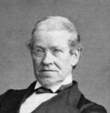
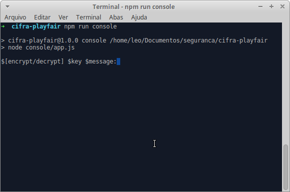

# Cifra de Playfair

A Playfair é uma cifra de bloco primitiva criada em 1854 pelo cientista Charles Wheatstone. Está cifra usa alguns princı́pios comuns às cifras de bloco atuais. Pra mais detalhes: <a href="http://www.numaboa.com.br/criptografia/substituicoes/poligramicas/1041-playfair">Cifra de Playfair</a>

Algoritmo implementado para disciplina de Segurança da Informação da Universidade Federal do Ceará campus Quixadá.

## Instalar Dependências

Execute `npm install` no diretório raiz do projeto para instalar todas as dependências.

## Executar Projeto

Execute `npm run console` no diretório raiz do projeto.

## Alfabeto Utilizado

*ABCDEFGHIJLMNOPQRSTUVWXYZ*